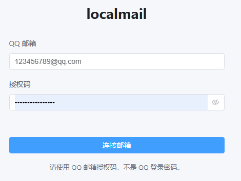
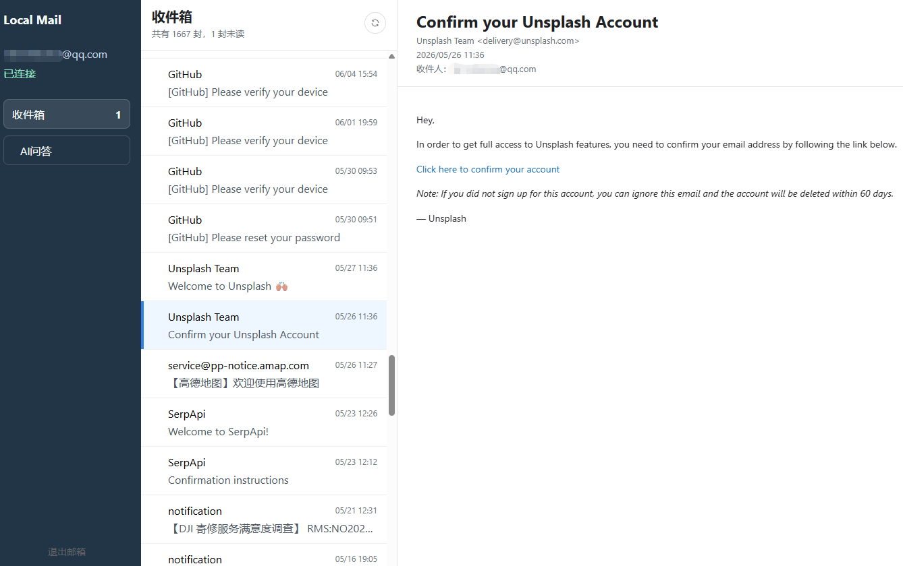
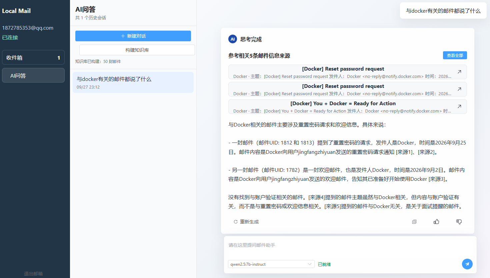

# localmail

一个本地运行的 QQ 邮箱只读客户端。前端使用 Vue 3、TypeScript、Pinia、Element Plus 和 DOMPurify；后端使用 FastAPI，通过 Python 标准库 `imaplib` 连接 `imap.qq.com:993`。

## 功能范围
- 只支持单个 `@qq.com` 邮箱账号。

- 只读取“收件箱”，首次加载最近 30 封邮件，支持加载更早邮件和手动刷新。

- 点击邮件后用 `BODY.PEEK` 读取正文，不修改服务器上的已读状态。
- 支持纯文本、HTML 和常见 multipart 邮件。
- HTML 正文经 DOMPurify 清理后放入无脚本权限的 sandbox iframe。
- AI 问答支持通过本机 Ollama 调用 `qwen2.5:7b-instruct` 进行多轮对话。

- 邮件知识库支持索引最近 50 封收件箱邮件，使用 `bge-m3:latest` embedding、Chroma 向量库和 SQLite FTS5 BM25 多路召回，并在检索前做查询规范化、关键词抽取、实体扩写和轻量指代改写，召回后通过 RRF + 规则重排序筛选引用。
- 不支持发信、SMTP、搜索、删除、移动、附件下载、多账号和离线缓存。

## 系统要求

- Python 3.12+
- Node.js 20+
- QQ 邮箱需先开启 IMAP 服务
- 登录时必须使用 QQ 邮箱授权码，不是 QQ 登录密码
- Ollama 已安装并已下载 `qwen2.5:7b-instruct` 和 `bge-m3:latest`

## 后端开发

```powershell
cd backend
python -m venv .venv
.\.venv\Scripts\Activate.ps1
pip install -e ".[dev]"
uvicorn app.main:app --host 127.0.0.1 --port 8000 --reload --workers 1
```

AI 问答默认调用本机 Ollama OpenAI-compatible 接口：

```powershell
ollama pull qwen2.5:7b-instruct
ollama pull deepseek-r1:7b
ollama pull bge-m3:latest
ollama serve
```

默认配置：

```text
LOCAL_LLM_BASE_URL=http://127.0.0.1:11434/v1
LOCAL_LLM_MODEL=qwen2.5:7b-instruct
LOCAL_LLM_MODELS=qwen2.5:7b-instruct,deepseek-r1:7b
LOCAL_LLM_TIMEOUT_SECONDS=300
OLLAMA_BASE_URL=http://127.0.0.1:11434
LOCAL_EMBED_MODEL=bge-m3:latest
LOCAL_EMBED_TIMEOUT_SECONDS=300
```

前端模型下拉框会优先读取 Ollama 本地 `/api/tags` 中已安装的模型；如果 Ollama 暂不可用，则使用 `LOCAL_LLM_MODELS` 配置作为兜底。

知识库数据默认保存在 `backend/data/rag/`，退出邮箱后不会自动删除。

## 前端开发

```powershell
cd frontend
npm install
npm run dev
```

前端开发服务运行在 `http://127.0.0.1:5173`，通过 Vite 代理访问后端 `/api`。

## 构建与本地发布

```powershell
.\scripts\build.ps1
.\scripts\run.ps1
```

发布模式只启动 FastAPI，访问 `http://127.0.0.1:8765`。请保持单 worker，因为会话和 IMAP 连接仅保存在当前进程内存。

## Docker 一键部署

项目已支持通过 `docker-compose.yml` 容器化部署。Compose 会同时启动应用服务和 Ollama 服务：

- `app`：构建前端静态资源并启动 FastAPI，统一提供页面和 `/api` 接口。
- `ollama`：启动本地模型服务。首次启动后需手动拉取所需模型（见下方说明）。

前置要求：已安装 [Docker Desktop](https://www.docker.com/products/docker-desktop/)（含 Docker Compose）。

```bash
# 构建并前台启动
docker compose up --build

# 后台运行
docker compose up --build -d

# 查看日志
docker compose logs -f

# 停止容器，保留模型和知识库数据
docker compose down
```

启动后，在另一个终端拉取所需模型（首次需要，模型会持久化在 volume 中）：

```bash
docker compose exec ollama ollama pull qwen2.5:7b-instruct deepseek-r1:7b bge-m3:latest
```

模型拉取完成后访问 `http://127.0.0.1:8765`。

当前 Compose 配置：

```text
应用访问地址：http://127.0.0.1:8765
Ollama 地址：http://127.0.0.1:11434
app 容器内 Ollama 地址：http://ollama:11434
默认对话模型：qwen2.5:7b-instruct
可切换对话模型：qwen2.5:7b-instruct,deepseek-r1:7b
Embedding 模型：bge-m3:latest
```

数据持久化：

- `ollama-models` volume：保存 Ollama 模型文件，避免每次启动重新下载。
- `rag-data` volume：保存邮件 RAG 知识库数据，`docker compose down` 后仍会保留。

如需彻底清理容器、模型和知识库数据：

```bash
docker compose down -v
```

注意：`docker compose down -v` 会删除 `ollama-models` 和 `rag-data`，下次启动需要重新下载模型并重新构建邮件知识库。

如果本机已经有单独运行的 Ollama，占用了 `11434` 端口，可以先关闭本机 Ollama，或者修改 `docker-compose.yml` 中 `ollama` 服务的端口映射。容器内 `app` 通过 `http://ollama:11434` 访问 Compose 内部的 Ollama 服务，不依赖宿主机上的 Ollama 进程。

如果需要 GPU 加速 Ollama，在 `docker-compose.yml` 的 `ollama` 服务下添加：

```yaml
    deploy:
      resources:
        reservations:
          devices:
            - driver: nvidia
              count: all
              capabilities: [gpu]
```

## 安全说明

- 后端固定连接 `imap.qq.com:993`，不允许前端配置服务器地址。
- 授权码只保存在后端内存，不写入文件、数据库、日志或浏览器持久化存储。
- 会话使用 HttpOnly、SameSite=Strict Cookie。
- 邮件内容接口设置 `Cache-Control: no-store`。
- 会话空闲 30 分钟后自动失效，退出时关闭 IMAP 连接。
- 本地脚本发布时 FastAPI 建议只监听 `127.0.0.1`；Docker 容器内需要监听 `0.0.0.0` 才能通过端口映射访问。如只允许本机访问，可将 Compose 端口映射改为 `127.0.0.1:8765:8765`。

## 常见错误

- 授权码错误：确认使用的是 QQ 邮箱生成的授权码。
- IMAP 未开启：在 QQ 邮箱设置中开启 IMAP/SMTP 服务后再试。
- 网络超时：检查本机网络是否能访问 QQ 邮箱 IMAP 服务。
- 会话过期：重新输入邮箱和授权码连接。
- 邮件过大：超过 8 MB 的邮件正文不会加载。
